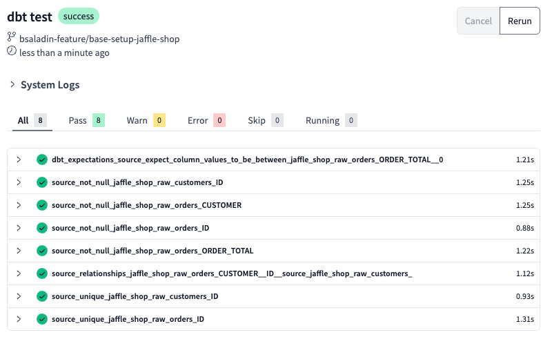

# Data Quality Testing in dbt

## Introduction

Ensuring data integrity is critical for reliable analytics. **dbt allows automated data testing** to catch inconsistencies **before** they impact downstream reports. By implementing **column-level tests**, we can enforce business rules and improve trust in our data models.

dbt provides built-in test types and supports custom tests through packages like **dbt-utils** and **dbt-expectations**.

---

## 1. Defining Data Quality Tests

In dbt, tests are defined within the `.yml` files alongside the models (preferred) or schemas they validate.

**Example: Basic Tests on the `stg_orders` Model in the staging schema**
```yaml title="./models/staging/staging.yml" linenums="1" hl_lines="7-9 12-15"
models:
    - name: stg_orders
      description: "Staging model for orders"
      columns:
        - name: order_id
          description: "Unique identifier for each order"
          tests:
            - unique
            - not_null
        - name: order_total
          description: "Total value of the order"
          tests:
            - not_null
            - dbt_utils.accepted_range:
                min_value: 0
```

!!! note "Test Types"
    - unique: Ensures that order_id does not contain duplicates
    - not_null: Ensures order_total and order_id have no missing values
    - accepted_range: Ensures order_total is always ≥ 0 (i.e., no negative totals)


---

## 2. Add dbt-expectations for advanced testing

Add package dbt-expectations to your packages.yml file

```yaml title="./packages.yml" linenums="1" hl_lines="4-5"
packages:
  - package: dbt-labs/dbt_utils
    version: [">=1.0.0", "<2.0.0"]
  - package: calogica/dbt_expectations
    version: [">=0.10.1", "<0.11.0"]
```

Run dbt deps to install the package

```bash
dbt deps
```

See all the tests available in the dbt-expectations package [here](https://hub.getdbt.com/calogica/dbt_expectations/latest/){target=_blank}.

---


## 3. Add data quality tests

Add data quality tests to your dbt project in the source.yml file

```yaml title="./models/staging/source.yml" linenums="1" hl_lines="13-15 20-22 24-28 30-34"
version: 2

sources:
  - name: jaffle_shop
    database: PSA
    schema: JAFFLE_SHOP
    description: Mock data
    tables:
      - name: raw_customers
        description: One record per person who has purchased one or more items
        columns:
          - name: ID
            tests:
              - unique  # Ensures no duplicate Order IDs
              - not_null  # Ensures no NULL values        
      - name: raw_orders
        description: One record per order (consisting of one or more order items)
        columns:
          - name: ID
            tests:
              - unique  # Ensures no duplicate Order IDs
              - not_null  # Ensures no NULL values
          - name: CUSTOMER
            tests:
              - not_null  # Ensures all orders are linked to a customer
              - relationships: # Ensures every CUSTOMER(_ID) in raw_orders exists in raw_customers as ID
                  to: source('jaffle_shop', 'raw_customers')
                  field: ID
          - name: ORDER_TOTAL
            tests:
              - not_null
              - dbt_expectations.expect_column_values_to_be_between:
                  min_value: 0  # Allows 0 and positive values
                  severity: warn  # Logs a warning instead of failing the run
      - name: raw_items
        description: Items included in an order
      - name: raw_stores
        description: All stores from jaffle shop
      - name: raw_products
        description: One record per SKU for items sold in stores
      - name: raw_supplies
        description: One record per supply per SKU of items sold in stores
```


---

## 4. Running Tests

Running dbt tests is as simple as adding the below code to the command line and run it with `Cmd + Enter` on Mac or `Ctrl + Enter` in Windows. Execute the command below:

```bash
dbt test
```
---
This command will:

- Validate all tests in the project.
- Identify any failing records.
- Provide a summary of passed/failed tests.

Example output:

Timestamp | Status |
--- | --- |
16:12:45 | 1 of 3 PASS unique test on stg_orders.order_id
16:12:45 | 2 of 3 PASS not_null test on stg_orders.order_total
16:12:45 | 3 of 3 FAIL accepted_range test on stg_orders.order_total

❌ A failure on accepted_range means there are negative order totals that need fixing.

---

In our case, you should see the following results:



Great! All tests passed!🎉

Commit the changes to your repository. Add a commit message `Add data quality tests`.

**Merge the branch into main.**


---

## 5. Advanced Granular Test Configuration

dbt allows defining granular conditions within test configurations. This ensures flexibility and targeted validation for business rules. If you like, you can also add this logic in your code in a new file `./marts/staging/staging.yml`.

**Example: Conditional Severity for order_total**

```yaml title="Granular Testing " linenums="1" hl_lines="5-11"

models:
  - name: stg_orders
    columns:
      - name: order_total
        tests:
          - not_null:
              config:
                severity: error
                error_if: ">50"
                warn_if: ">0"
                where: "status IN ('completed', 'shipped')"

```

Dynamic thresholds:

- error_if: ">50" → Fails if order_total exceeds 50
- warn_if: ">0" → Raises a warning if order_total is greater than 0
- where: "status IN ('completed', 'shipped')" → Applies only to completed & shipped orders


---

## 6. Tip for Handling Test Failures

When a test fails, dbt provides detailed logs with failing records. You can let dbt add this information into snowflake to identify failed records. More information [here](https://docs.getdbt.com/reference/resource-configs/store_failures){target=_blank}.

This helps teams quickly identify, debug, and fix data issues.

🎉 Next Steps

By integrating dbt’s testing capabilities, we can automate data validation and prevent bad data from entering downstream reports.

🔗 Continue to: 🔗 **Continue to:** [dbt Documentation & Deployment](dbt-deployment.md)