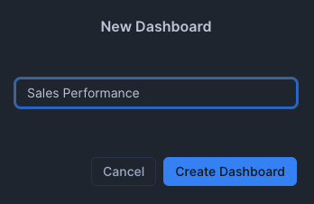
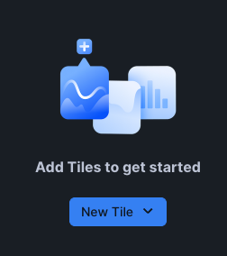
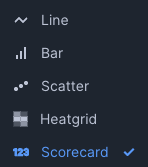
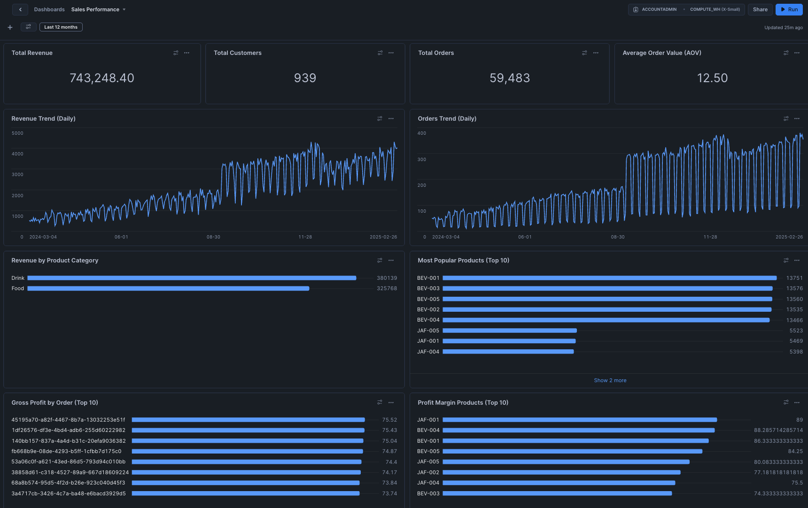

# Data Visualization in Snowflake

## Introduction

Once our data has been **ingested, transformed, and validated**, the next step is **visualizing it** to enable better business insights.  
**Snowflake Dashboards** provide a **built-in, out-of-the-box visualization tool**, allowing users to explore data without third-party BI tools.  

By the end of this section, you will:

- Have a **fully built in Snowflake dashboard**  
- Use **interactive charts** for business analysis  


---

## 1. Creating a New Dashboard in Snowflake

To start visualizing your data:

1. **Go to the Snowflake UI**, navigate to the top left and **+Create > Dashboard**. Give it a name like `Sales Performance`. **Create Dashboard**.

   

2. Click on **"New Tile** and select **"Create New Dashboard"**.

    

    and select **"From SQL Worksheet"**.

    

3. **Set the Context** (`ANALYTICS.DM`).

   

Go to the next step to create a tile (chart) for the dashboard.

---

## 2. Creating a Tile (Chart) to the Dashboard

1. Enter your SQL query in the **SQL Worksheet** and rename the sheet on the top in the middle.

    

```sql
SELECT
    SUM(ORDER_TOTAL) AS total_revenue
FROM orders;
```
 or if you want to be more explicit:

```sql
SELECT
    SUM(ORDER_TOTAL) AS total_revenue
FROM DM.ORDERS;
```

2. **Click "Run"** to preview the results.

    Run the query by hitting on Win CTRL + Enter, Mac CMD + Enter or by clicking on the **Run** button on the top right.

---

## 3. Choosing a Chart Type

1. **Click on the "Chart" tab** to visualize the data.
2. **Select a Chart type**:
   - **Line Chart** – Show trends over time.
   - **Bar Chart** – Compare total orders by status.
   - **Scatter Plot** – Analyze the relationship between order total and quantity.
   - **Heat Grid** – Visualize order distribution.
   - **Scorecard** – Display a single KPI value.

    

3. **Add the Tile to your Dashboard** by clicking on **"Return to <dashboard_name>"**.

    

Repeat the process to add more tiles to the dashboard.

---

## 4. Enhancing the Dashboard with Filters

1. **Select a Tile** and **Edit Query**.

    If you select the filter icon on the top left, 

    

    you can see which filters are available by default 

    

    and the option to add your custom filters.


2. **Add a Filter** to the query.

    


    ```sql linenums="1"
    SELECT
        SUM(ORDER_TOTAL) AS total_revenue
    FROM DM.ORDERS
    WHERE :daterange = ordered_at;
    ```

2. **Return to your Dashboard** and repeat that process for other tiles to add filters.

    !!! note "Dashboard Filters"
        Filters can be applied to multiple tiles, allowing users to interactively explore data. You can control the filter on the top left.
        
        

3. **Customize the layout** by dragging and resizing tiles for better clarity. Congratulations on building your first Snowflake dashboard.

    

✅ **Your dashboard is now live and interactive!**  
Users can **filter, explore, and share insights** directly within Snowflake.


---

## 🎉 This is the end of the Hands-On Lab. 🎉


🔗 **For more References, go to:** [Further Resources](resources.md)


