# dbt Deployment & Documentation

## Introduction

Deploying dbt models effectively ensures that transformations run on a **scheduled basis**, providing fresh and reliable data to downstream analytics.

Additionally, **documentation** serves as a **single source of truth**, helping teams understand **data lineage, model definitions, and test coverage**.

At the moment, the Explore section of dbt Cloud is empty. Let's **deploy our models** and **generate documentation** to populate it.

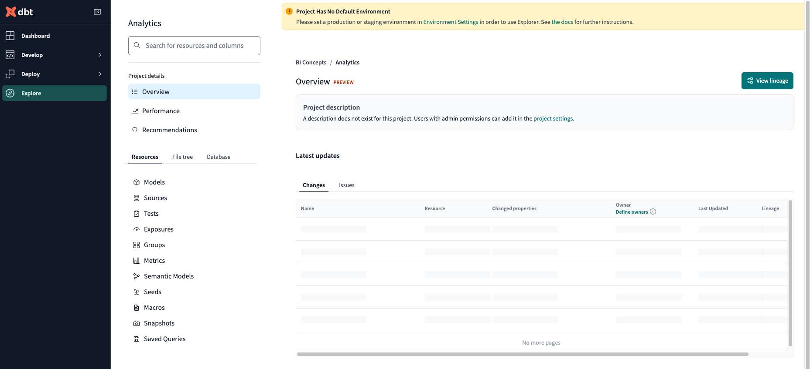 
---

## 1. Setting Up a Production Environment

A production environment ensures that **only tested, validated models** are exposed to analysts.

### **Steps to Set Up a Production Environment**
1. **Go to dbt Cloud** → Click **Deploy** > **Environments**.
2. **Create a New Environment**:
   - **Name**: `PRD`
   - **Deployment type**: `Production`
   - **Connection**: `Snowflake_HWZ`
   - **Deployment credentials**: Use the Snowflake credentials.
   - **Schema**: `default`

    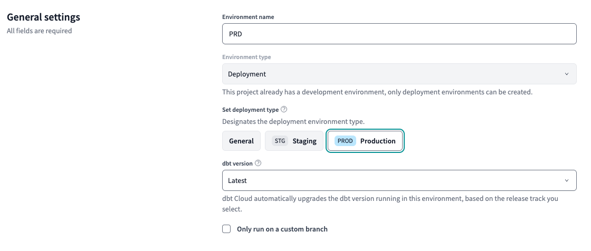

    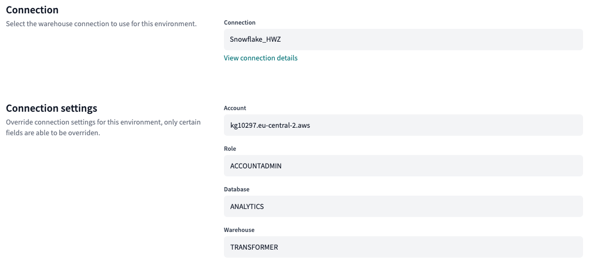

3. **Test the Connection** to ensure successful setup.

        

4. **Save** the environment.

---

## 2. Setting Up a Production Deploy Job

Go to the bottom right `+ Create job`

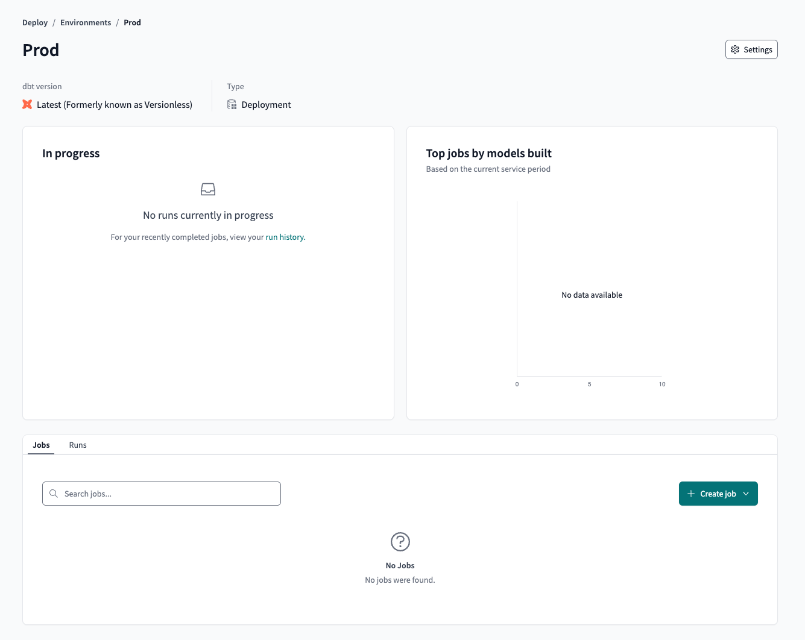

Select `Deploy job`

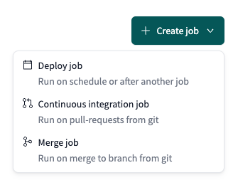

Add the following details:

- **Job name**: `PRD`
- **Environment**: `Prod`
- **Generate docs on run**: [x]

    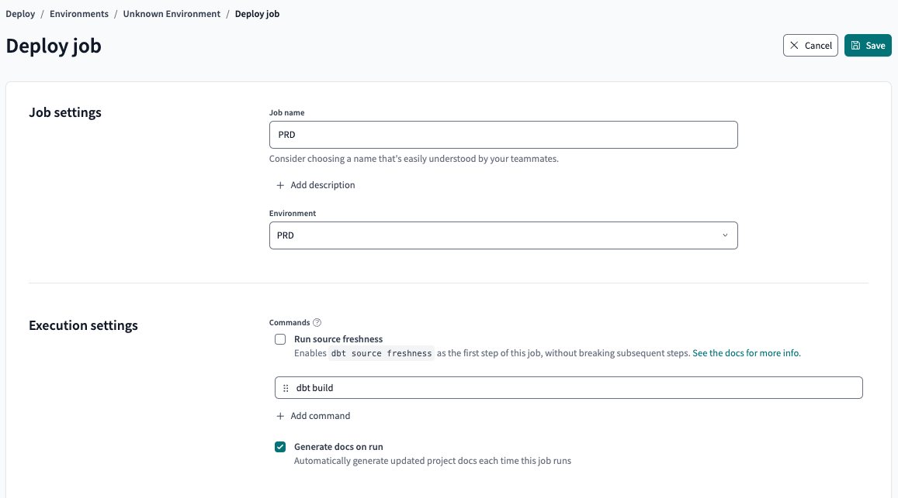

- **Target name**: `PRD`
- **Threads**: `16`

    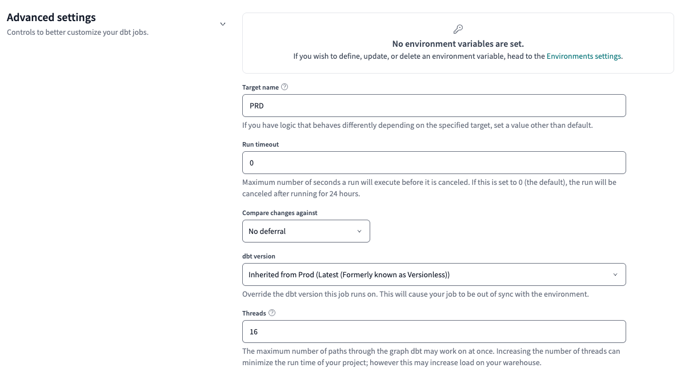

**Save** the job.

**Run now** to deploy the models to the production environment.

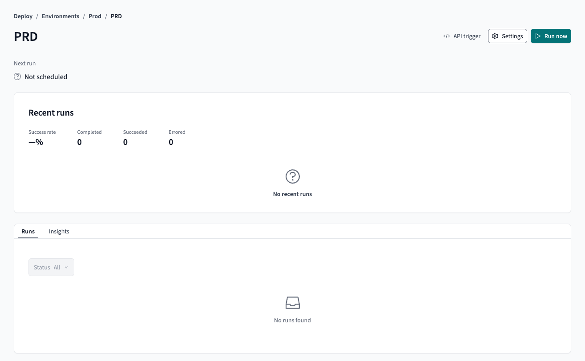
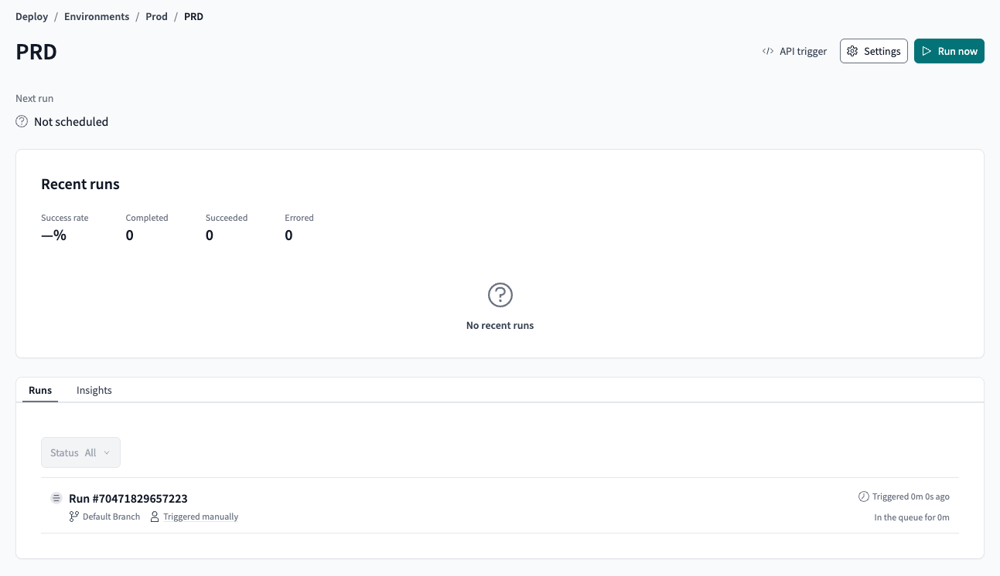

Success! The models are now deployed to the production environment and the documentation is generated.

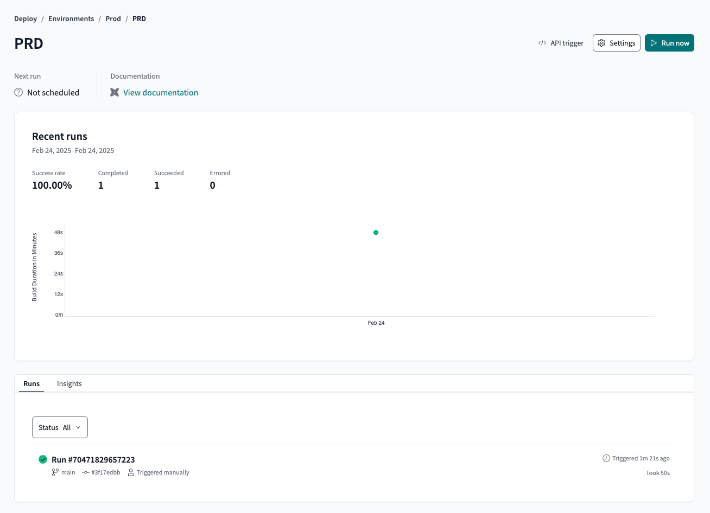

Go to the **Explore** section to view the documentation.

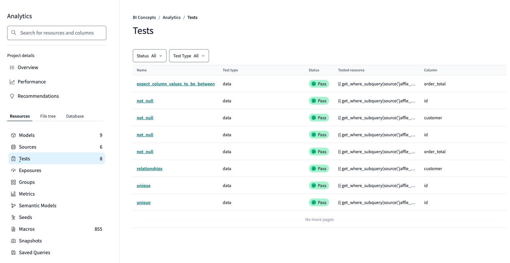

As we have not yet added a lot of .yml files, tests and other features, the documentation is not very detailed. But this will get richer as we add more features to our dbt project.

---

## 🎉 Next Steps

Your dbt project is now **automated, tested, and documented**!  
Proceed to **building dashboards** with your transformed data.

🔗 **Continue to:** [Building Dashboards with Snowflake](data-visualization.md)