# Snowflake Account Setup

This section walks you through setting up a Snowflake account, creating the necessary databases, and configuring the environment for the hands-on lab.

To keep track of your login details for Snowflake, Fivetran, and dbt, download and fill out the following template:

📄 [Download Login Details Template](assets/templates/login_details_template.txt){:download}


!!!note "This template includes sections for:"

    1. **Snowflake Account Details**

        1. Full Account Locator (e.g. `KG10297.AWS_EU_CENTRAL_2.AWS`):
        2. Account Locator (e.g. `KG10297`):
        2. Account/Server URL (e.g. `BYELBTA-MV59868.snowflakecomputing.com`): 
        3. Username <your_username>:
        4. Password <your_password>:
        5. Warehouse Name: `TRANSFORMER`
        6. Database Names: `PSA`, `ANALYTICS`

    1. **dbt Account Details**
        
        1. Username <your_username>:
        2. Password <your_password>:
        3. Project Name `ANALYTICS`:

    1. **Fivetran Account Details**

        1. Username <your_username>:
        2. Password <your_password>:
        3. Connector Source Details:
            ```
            https://drive.google.com/drive/u/0/folders/1Z_U_6SVP6vWXGJWHu9Fl_uUjieyVjaWX
            ```

Make sure to save this file securely and update it as needed.

---

## 1. Creating a Snowflake Account

To get started, sign up for a free **Snowflake Trial**.

1. Visit the [Snowflake Sign-Up Page](https://signup.snowflake.com/){:target="_blank"}. And enter your first name, last name, and work email address. Select a reason for signing up, tick if you want to opt out of marketing emails and click **Continue**.

    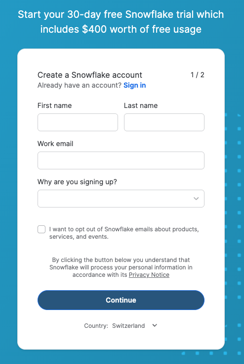

    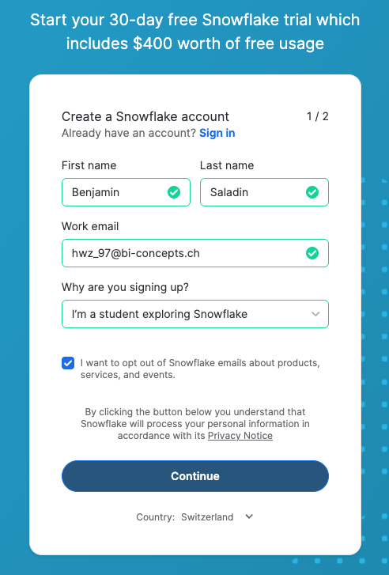

2. Choose your preferred cloud provider (AWS, Azure, or GCP). We prefer **AWS** for this lab, and also in general this is the most popular choice, since new features are usually released on AWS first. Click **Get Started**.

    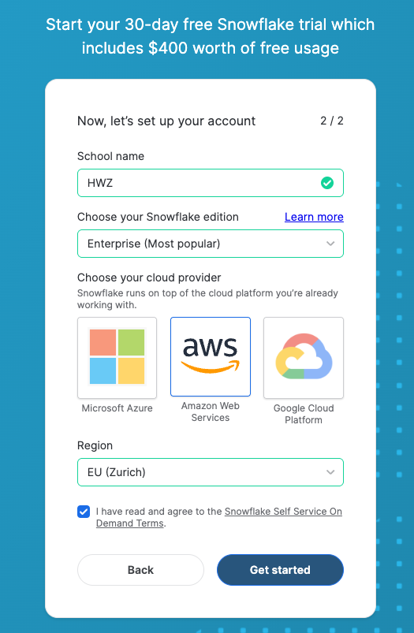

    !!! warning "Captcha"
        You might encounter a captcha here.

3. You can either fill the next two forms or skip them. We recommend skipping them for now.

    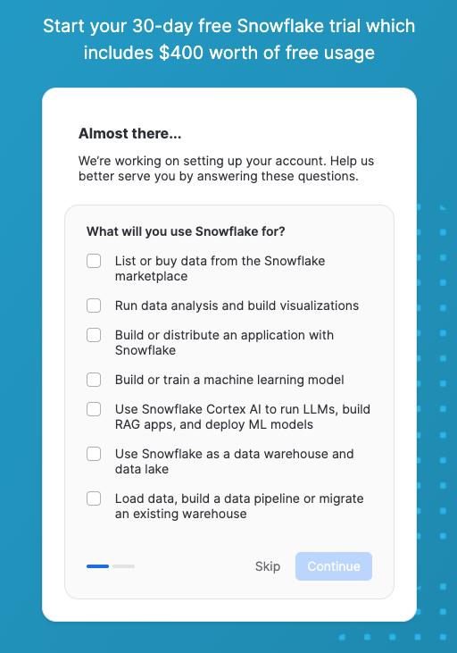

    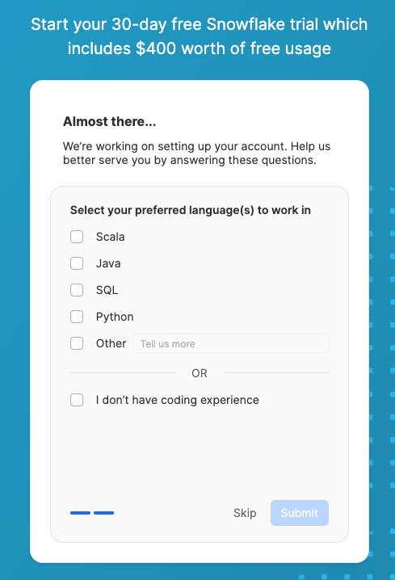

4. Check your email and follow the activation link. It might take a few minutes for the email to arrive.

    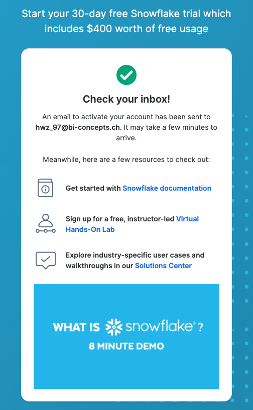

    And here it is:

    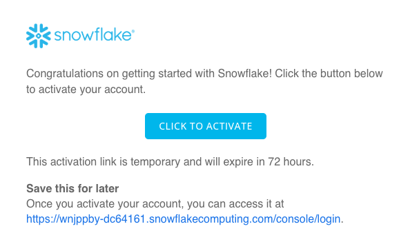

5. Click on the **Click To Activate** button. You will be redirected to the Snowflake login page.

    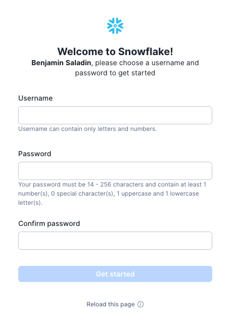

    Fill in a username and a password and then confirm. **Note down** these credentials as you will need them later.

    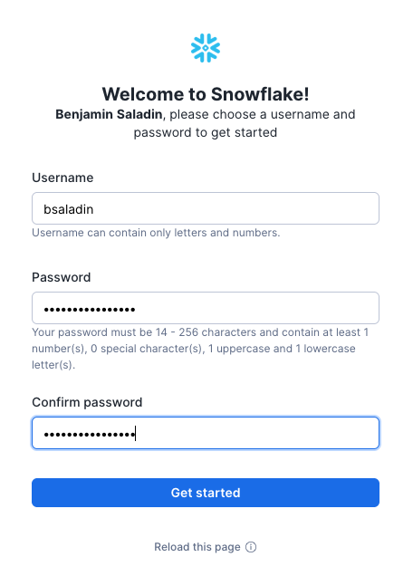

    !!! info "Username and password requirements"
        Username must be in letters and numbers.
        The password must contain between 14-256 characters, at least one uppercase letter, one lowercase letter and one number.

6. You will be redirected to the Snowflake UI. You are now ready to start using Snowflake. Skip this screen for now.

    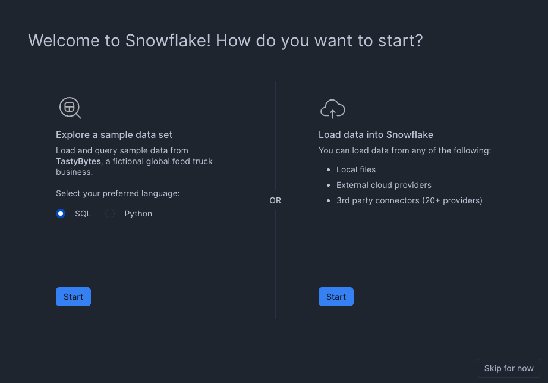
---

## 2. Retrieve Snowflake Account Details

Now you can see the standard **Snowflake UI**.


1. Find your account **Account/Server URL** & **Full Account Locator** and note them down in the `download.txt` from the top of this page. Click on your initials in the bottom left corner.

    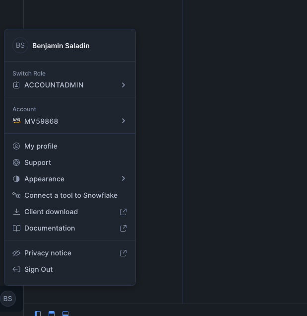

    **View account details**

    

    Note down the `Full Account Locator` and the `Account/Server URL`

    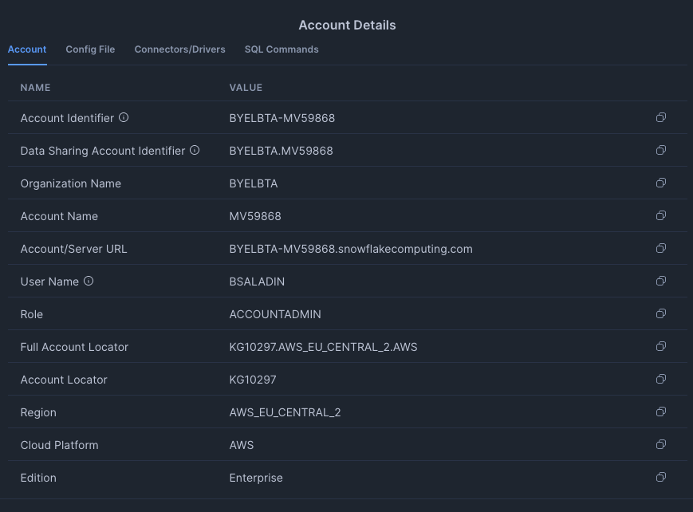

2. Go to the next section.


---
## 3. Creating Databases

For this hands-on lab, we need two databases:
- **PSA** (Persistent Staging Area)
- **ANALYTICS** (Final Data Warehouse)

=== "UI based"
    1. Click on the **Data** tab on the left.

        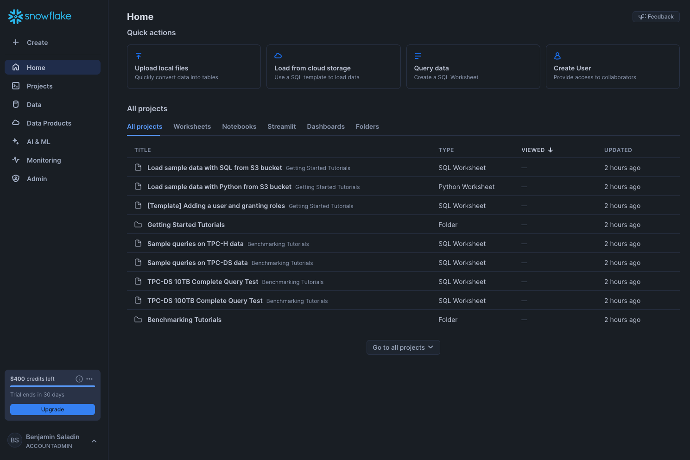

    2. Click **Database > + Database** button.

        

    3. Enter the database name (`ANALYTICS` and `PSA`). Then click **Create**.

        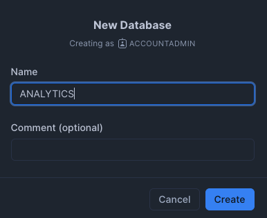

    4. The new databases have now appeared in the UI.

        

    5. Go to the next section.


=== "Code based"
    
    1. Go to **Projects** and then **Worksheets**.

    2. Click on the **+** button on the top right corner to create a new SQL worksheet.

    3. Run the following SQL to create them:
        ```sql
        CREATE DATABASE PSA;
        CREATE DATABASE ANALYTICS;
        ```
        Output from PSA command:
        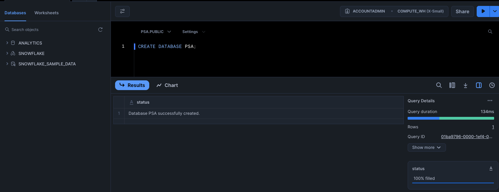
    4. Verify that the databases have been created:
        ```sql
        SHOW DATABASES;
        ```
    5. You should see the two databases listed. Go to the next section.


---

## 4. Compute Warehouse Setup

Snowflake uses **virtual warehouses** to process queries (they are essentially workers). Create a warehouse for this lab:

=== "UI based"
    1. Click on the **Admin Section** tab on the left.

        

    2. Select Warehouses and then click on the **+ Warehouse** button on the top right.

        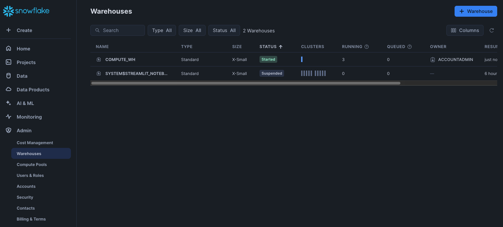

    3. Enter the warehouse name (`TRANSFORMER`), under **Advanced Options** add 1 for **Suspend After**, and click **Create Warehouse**.

        

    4. The new warehouse has now appeared in the UI.

        

    5. Go to the next section.

=== "Code based"
    1. Run the following SQL to create a warehouse named `TRANSFORMER` in a SQL worksheet:

        ```sql
        CREATE WAREHOUSE TRANSFORMER
        WITH WAREHOUSE_SIZE = 'XSMALL'
        AUTO_SUSPEND = 60
        AUTO_RESUME = TRUE
        INITIALLY_SUSPENDED = TRUE;
        ```

        This ensures:

        **Cost Efficiency** → Auto-suspends when not in use.  
        **Performance** → Automatically resumes when queries are executed

    2. Verify that the warehouse has been created:

        ```sql
        SHOW WAREHOUSES;
        ```

    3. You should see the new warehouse listed. Go to the next section.
    
        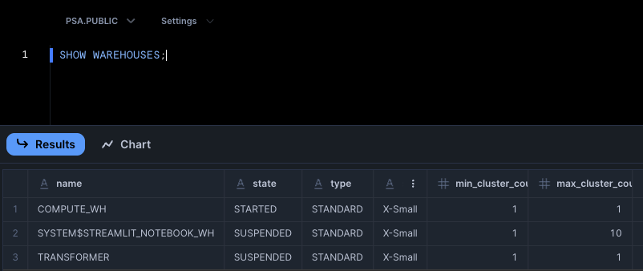


---

## 5. Navigating Snowflake

Let’s explore the **Snowflake UI**.


---

## Next Steps

Now that we have our **user**, the **databases** and a **warehouse** set up, we are ready to move on to **data transformation with dbt Cloud**.

 **Continue to the next section: [dbt Cloud Setup](dbt-setup.md)** 🚀